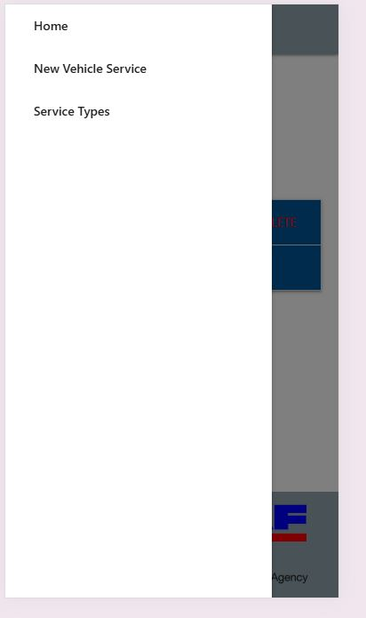
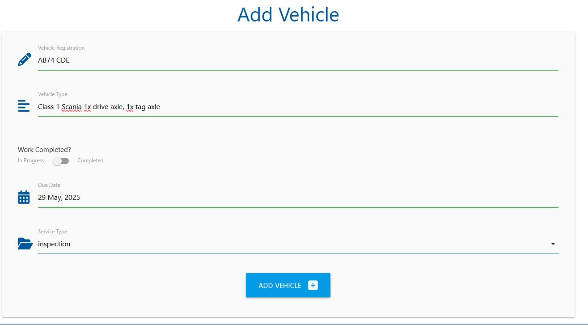

# Mile Stone Project 3 - HGV Service Scheduler

For my Milestone Project 3 I am creating a front end website linked to a Postgres database.  This will use python to allow a user CRUD functionality in organising and maintaining a HGV service schedule app.

The purpose of the site is to allow a quick and easy method to add, view, edit and delete different service types and be able to add, edit and delete individual services by vehicle to their respective services.

[Visit deployed website](https://ms3-5cda93b0a75f.herokuapp.com/)

## Table of Contents
1. [User Experience (UX)](#user-experience-ux)
    1. [Project Goals](#project-goals)
    2. [Target Audience](#target-audience)
    3. [User Goals](#user-goals)
    4. [Color Scheme](#color-scheme)
    5. [Typography](#typography)
    6. [Wireframes](#wireframes)
2. [Features](#features)
    1. [Database Design](#database-design)
    2. [General](#general)
    3. [Landing Page](#landing-page)
    4. [Service Types Page](#service-types-page)
    5. [Add Service Type Page](#add-service-type-page)
    6. [Edit Service Type Page](#edit-service-type-page)
    7. [Add Vehicle Page](#add-vehicle-page)
    8. [Edit Vehicle Service Page](#edit-vehicle-service-page)
    9. [Not Implemented](#features-left-to-be-implemted-in-future-releases)
3. [Technologies Used](#technologies-used)
    1. [Languages Used](#languages-used)
    2. [Frameworks, Libraries and Programs Used](#frameworks-libraries-and-programs-used)
4. [Testing](#testing)
    1. [Testing User Stories](#testing-user-stories)
    2. [Code Validation](#code-validation)
    3. [Accessibility](#accessibility)
    4. [Tools Testing](#tools-testing)
    5. [Manual Testing](#manual-testing)
5. [Finished Product](#finished-product)
6. [Deployment](#deployment)
    - [Heroku](#heroku)
7. [Credits](#credits)
    1. [Content](#content)
    2. [Media](#media)
    3. [Code](#code)
8. [Acknowledgements](#acknowledgements)

***

## User Experience (UX)

### Project Goals

- The website should offer CRUD functionality, accessed by the user from a front end app using a Postgres database.

- The website should have a simplistic functional apperance.  The sale point of the app would be performance based, as such visuals should be of a simple nature.

- The range of options/controls should be clear and unambiguous, there could be a range of IT profiencies from users.

- This site should detail the necessary information, such as service type, vehicle type, schedule dates, vehicle registration, service due date.

### Target Audience

- The website primary aim is functionality for intended purpose as a service scheduler.  As such would be used by multiple users looking to perform a function within the task span from planning a service, customers viewing upcoming services and technicians reporting job complete.  With that in mind there are several aspects to consider:
    - The user could be of any gender, so appearances should remain neutral.
    - Whilst the website is intended to be as easy to use as possible, it is highly likely that the user will have a fair to strong understanding of the commercial vehicle service schedule requirements.
    - The function of the app should be a priority over visual asthetics.

### User Goals

- As a user, I want to be able to navigate the controls intuitively and know which option to choose.

- As a user, I want to be able to clearly create a custom service type.

- As a user, I want to be able to asign a vehicle with all relevant information to service type.

- As a user, I want to be able to have the abilty to view and edit existing vehicle services.

- As a user, I want to be able to delete/cancel a service booking.

- As a user, I want to be able to view whether a service has been completed.

### Color Scheme

The colour used for nav bar and footer is blue-grey (#90a4ae), used purposely as a colour which is easy on the eyes in the event of prolonged use, but still allows for clear definition of a less active area of the site.

The Colour used for headers of more active areas of the app is a dark version of light-blue (#01579b).  Intended to draw the user to that active area of the app whlist still appearing neutral in appearance.

### Typography

The main font used in the site is Raleway, with Sans-Serif as the fallback font in case Raleway is not being imported correctly.

### Wireframes

The team statistics section for team 1 develops as the game progresses (see below), at the start of play it will not show.

## Features

### Database Design

Flake8 was used to enforce python style conformity

### General

- Responsive design across multiple device sizes.
- Consistent colour scheme and design across all pages to enhance the user's navigation through the content.
- Any user input requiring a date will use a javascript initialised date picker.

#### Header

- The header contains the business name, in this instance it is also the purpose of site.

- The header contains the navbar.  On large and medium sized screens appears on right side of header.  On small screen sizes the navbar becomes collapsed.

#### Footer

- The footer includes links to multiple HGV dealer service centre locator sites and a link to DVSA HGV page.

- The footer alters in style on small screen sizes.

### Landing Page

#### Welcome Image and Text

- The Welcome main image is designed to state the nature and purpose of the page.  It has been designed to a colour and size to contrast against the background and stand out without drawing attention from the primary area of the app.

#### Main Content

- The main content is centred on the page.
  - Below page title is located a button to generate a new vehicle service.  This button directs the user to specific page.
  - A series of vehicle services will be displayed as collapsible dropdowns.
  - The visible element of the drop down displays priority information
    - Vehicle registration
    - Due date for completion
    - Completion status
      - Services yet to be completed are highlighted with red exclamation mark and text to catch the eye of the user to incomplete tasks.
      - Completed services are marked with green tick.

  

- Accessing the drop down provides further detail:
    - Service type
    - Vehicle description
    - Options for editing or deleting the vehicle service

  

- Choosing the delete button will prompt a modal requesting confirmation of delete.

  
    
### Service Types Page

#### Welcome Image and Text

- The Welcome main image is designed to state the nature and purpose of the page.  It has been designed to a colour and size to contrast against the background and stand out without drawing attention from the primary area of the app.

#### Main Content

- The main content is centred on the page.
  - Below page title is located a button to generate a new service type.  This button directs the user to specific page.
  - A series of service types will be displayed as materialize cards.
    - The number of cards per row depends on screen size.
    - Each card presents the user with service type title and buttons to either edit or delete this service type.
    - The delete function on the card cascades through the indivdual vehicle services linked to that service type, deleting all services of that type.  A modal will be displayed requesting confirmation of deleting service type.

### Add Service Type Page

#### Welcome Image and Text

- The Welcome main image is designed to state the nature and purpose of the page.  It has been designed to a colour and size to contrast against the background and stand out without drawing attention from the primary area of the app.

#### Main Content

- The main content is centred on the page.
  - Below page title is located a pane giving the user the option to create a new service type.
    - The panel comprises of a text input for service name and a submit button.
    - Submitting a service type assigns a unique service ID to the entry allowing vehicles to be assigned to that branch.
    - Submitting the service type then returns the user to the service types page.
  
  

### Edit Service Type Page

- The edit service type page looks and operates very similar to the add service page, differing in that the page fetches the service information from the unique service ID for the user to alter rather than start a fresh.
  

### Add Vehicle Page

#### Welcome Image and Text

- The Welcome main image is designed to state the nature and purpose of the page.  It has been designed to a colour and size to contrast against the background and stand out without drawing attention from the primary area of the app.

#### Main Content

- The main content is centred on the page.
  - Below page title is located a pane giving the user the option to create a new vehicle service.
    - The panel comprises of a text input for service name and a submit button:
      - Vehicle registration
      - Vehicle type
      - Task status as a boolean switch, 'in progress' or 'completed'
      - Service due date
      - Service type as drop down, where the list values are generated by the avaiable service types committed to database.
    - Submitting the service type then returns the user to the vehicle services page.
  
  
  
  

### Edit Vehicle Service Page

- The edit vehicle service page looks and operates very similar to the add vehicle page, differing in that the page fetches the service information from the unique vehicle ID for the user to alter rather than start a fresh.
  

### Features Left to be Implemeted in Future Releases

- The site could operate different levels of logins to restrict different user types to enter and edit only certain areas of information.

### Technologies Used

* [HTML5](https://en.wikipedia.org/wiki/HTML5)
* [CSS3](https://en.wikipedia.org/wiki/CSS)
* [JavaScript](https://simple.wikipedia.org/wiki/JavaScript)
* [Python](https://en.wikipedia.org/wiki/Python_(programming_language))

### Frameworks, Libraries and Programs Used

* [Google Fonts](https://fonts.googleapis.com/)
    - Google Fonts was used to import the font Roboto and Exo into the style.css file. This font was used throughout the site.

* [GitHub](https://github.com/)
     - GitHub was used to store the project after pushing.

* [W3C Markup Validator](https://validator.w3.org/)
    - W3C Markup Validator was used to validate the HTML code.

* [W3C CSS Validator](https://jigsaw.w3.org/css-validator/)
    - W3C CSS Validator was used to validate the CSS code.

* [JavaScript Validator](https://jshint.com/)
    - JSHint JavaScript Validator was used to validate the JS code.

* [Materialize Library](https://materializecss.com/)
    - Materialize was used extensively throughout this app.

* [Jinja Integration](https://jinja.palletsprojects.com/en/stable/integration/#flask)
    - Jinja integration with flask has been used.

## Testing

### Testing User Stories

Manual testing relies on human interaction to execute test cases and identify defects in a software application, while automated testing uses pre-written scripts to run tests repeatedly and efficiently, with the key principles being that manual testing is more flexible and exploratory, while automated testing prioritizes speed, consistency, and regression testing across repetitive tasks. 

- As a user, I want to be able to navigate the controls intuitively and know which option to choose.
  - The pages are designed to be simple but effective, the options to available to the user are claer and unambiguous.

- As a user, I want to be able to clearly create a custom service type.
  - Within the services page there is a clear button labelled 'add service type' which takes the user to another page.  This page is simple and clear, allowing the user to create a new service type.  Upon submition the user is returned to the services page where the new service type is visible.

- As a user, I want to be able to asign a vehicle with all relevant information to service type.
  - Within the vehicles page there is a clear and unambiguous button allowing the user to create a new service.  This link is also available directly from the navbar.
  - Within the new page the series of inputs is presented in a clear and uncluttered manner to allow the user a clear understanding of what is required for inputs.

- As a user, I want to be able to have the abilty to view and edit existing vehicle services.
  - Within the vehicles page all services are listed, selecting a service prompts a drop down displaying information in a clear and concise format.  Within this information is a clear 'edit' button.
  - Selecting edit takes the user to new page presenting the user with the existing information linked to that vehicles unique vehicle ID.  Altering information and submitting here updates the database, retaining new information entered.

- As a user, I want to be able to delete/cancel a service booking.
  - Within indiviudal vehicle services is a clear delete button, clicking this button deleted that particular service of that ID.

- As a user, I want to be able to view whether a service has been completed.
  - Within the services page, incomplete services are highlighted with red 'INCOMPLETE' text and a red exclamation mark icon, making them clearly distinguishable from completed services.

### Code Validation

- W3 Validator has highlighted zero errors.

  
 

- W3C Validator shows zero errors with CSS:

  
 

- JSHint Validator shows zero errors, however 4 warnings all relating to mozilla browser compatability.

  
 

### Accessibility

* Used Lighthouse in Chrome DevTools to confirm that the colors and fonts being used in throughout the website are easy to read and accessible.

  

  

### Tools Testing

* Responsiveness

    - [Responsive Design Checker](https://www.responsivedesignchecker.com/) was used to check responsiveness of the site pages on different screen sizes.
    
  

  

  

    - Chrome DevTools was used to test responsiveness in different screen sizes during the development process.

### Manual Testing

* Common Elements Testing
        
    - Index Page

        - Team Name prompts appear without request on all screen sizes. - $${\color{green}PASS}$$
        - Player Name prompts appear without request. - $${\color{green}PASS}$$
        - Start innings hover effect works on desktop screen size. - $${\color{green}PASS}$$
        - All other buttons are grey and have no effect prior to 'start innings function'. - $${\color{green}PASS}$$
        - Start innings turns grey and has no effect following 'start innings' function- $${\color{green}PASS}$$
        - 'Start Innings' function produces bowling choice prompt. - $${\color{green}PASS}$$
        - All buttons produce desired effect, ie, a 'dot' or 'wide' alters the expected data, both visible and within object array. - $${\color{green}PASS}$$
        - 'Wicket' button produces desired result, replaces strike bat with the next bat on the list, shows the dismissed bat and their score within the correct pane. - $${\color{green}PASS}$$
        - Every 6th legal ball produces a prompt requesting user to choose an alternative bowler. - $${\color{green}PASS}$$
        - At bowler change the bats alternate strike. - $${\color{green}PASS}$$
        - At bowler change the stats are updated in correct pane and active bowler stats are changed. - $${\color{green}PASS}$$
        - After 5th wicket or 10th over the end of innings is dispalyed with score. - $${\color{red}FAIL - Not-implemented-yet}$$
        - After end of innings the teams and players names are reversed. - $${\color{red}FAIL - Not-implemented-yet}$$
        - Second Innings plays out in same way as first. - $${\color{red}FAIL - Not-implemented-yet}$$
        - After 5th wicket or 10th over of second innings prompt displays total scores and winning team. - $${\color{red}FAIL - Not-implemented-yet}$$

        - **Footer**
          - Hovering the cursor over nav bar link prompts active effect. $${\color{green}PASS}$$
          - Clicking on the league site link will open the specific website on a new tab. $${\color{green}PASS}$$

## Finished Product

## Deployment

* This website was developed using VS Code, which was then committed and pushed to GitHub using the VS Code terminal.  The site will be deployed by Heroku.

### Heroku

* Here are the steps to deploy this website from Heroku from its GitHub repository:

    1. Log in to Heroku and create a new project.
    2. Chooe nearest server location to current location.
    3. Add in config variables from env file, specifically:
        - DATABASE_URL - this variable links directly to the database platform.
        - IP
        - PORT
        - SECRET_KEY
        - DEBUG
    4. Within 'Deploy' section choose connect to 'GitHub' and search for the relevant repository.
    5. OPTIONAL - choosing 'Enable Automatic Deploys' keeps the Heroku live site up to date with any amendments pushed to GitHub.
    6. Choose 'Deplpoy Branch', will install dependencies from requirements file.
    7. Click 'Open App'.

## Credits

### Content

- Content is my own fictional work.

### Media

* [Volvo Trucks Logo](https://www.clipartmax.com/middle/m2H7H7H7G6Z5A0m2_commercial-fleet-cleaning-volvo-truck-logo-png/)
* [Scania Trucks Logo](https://www.swedishchamber.com.au/wp-content/uploads/2021/06/scania_lock-up_v_pos_L_rgb.png.webp)
* [DAF Trucks Logo](https://www.clipartmax.com/middle/m2H7H7b1i8A0K9K9_daf-logo-parallel/)
* [Mercedes Truck Logo](https://www.cleanpng.com/png-mercedes-benz-logo-8324655/)
* [DVSA Logo](https://content.govdelivery.com/attachments/fancy_images/UKDVSA/2021/07/4740648/dvsa-logo-digital-original_original.png)

### Code

* [W3Schools](https://www.w3schools.com/) was consulted on a regular basis for inspiration and sometimes to be able to better understand the code being implement.

* [Stack Overflow](https://www.stackoveflow.com/) was consulted on a regular basis for inspiration and sometimes to be able to better understand the code being implement.

## Acknowledgements

* My tutor, Len Johnson, for his tuition.
* My mentor, Marcel, for his feedback and guidance.